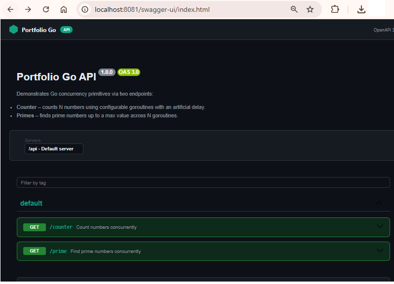

# Golang Concurrency Exploration
# Golang Concurrency Exploration

A Gin REST API built with **Go 1.26** that explores Go's native concurrency model: sequential execution, bounded goroutine pools, and unrestricted
goroutine-per-task dispatch — the Go equivalent of Java virtual threads.
Every request captures timing and goroutine identity so stress tests produce real, comparable data.

---

## Architecture Overview

```
┌─────────────────────────────────────────────────────────────────┐
│                        HTTP Client                              │
│              (browser / curl / k6 / stress test)                │
└───────────────────────────┬─────────────────────────────────────┘
                            │  REST  (port 8081)
┌───────────────────────────▼─────────────────────────────────────┐
│                     Gin HTTP App                                │
│                                                                 │
│   ┌─────────────────────┐      ┌─────────────────────────────┐  │
│   │   CounterHandler    │      │       PrimeHandler          │  │
│   │  GET /api/counter   │      │     GET /api/prime          │  │
│   └──────────┬──────────┘      └──────────────┬──────────────┘  │
│              │                                │                 │
│   ┌──────────▼──────────┐      ┌──────────────▼──────────────┐  │
│   │   CounterService    │      │        PrimeService         │  │
│   │                     │      │                             │  │
│   │  parallelProcess=1  │      │   parallelProcess=1         │  │
│   │  ┌───────────────┐  │      │   ┌─────────────────────┐   │  │
│   │  │  Sequential   │  │      │   │     Sequential      │   │  │
│   │  │  single loop  │  │      │   │   single loop       │   │  │
│   │  └───────────────┘  │      │   └─────────────────────┘   │  │
│   │                     │      │                             │  │
│   │  parallelProcess=N  │      │   parallelProcess=N         │  │
│   │  ┌───────────────┐  │      │   ┌─────────────────────┐   │  │
│   │  │ N goroutines  │  │      │   │   N goroutines      │   │  │
│   │  │  range-split  │  │      │   │  range partitioning │   │  │
│   │  └───────────────┘  │      │   └─────────────────────┘   │  │
│   │                     │      │                             │  │
│   │  parallelProcess=-1 │      └─────────────────────────────┘  │
│   │  ┌───────────────┐  │                                       │
│   │  │ 1 goroutine   │  │                                       │
│   │  │   per task    │  │                                       │
│   │  │  (N total)    │  │                                       │
│   │  └───────────────┘  │                                       │
│   └─────────────────────┘                                       │
│                                                                 │
│   CORS middleware  ─►  gin-contrib/cors                         │
└─────────────────────────────────────────────────────────────────┘
```

---

## REST API endpoints


---

## Modules

### `/api/counter` — Parallel Counter

Simulates a sequence of N external REST API calls where each call blocks the thread for countDelay milliseconds waiting for the remote response  — modelling real-world I/O-bound workloads such as downstream service calls or database queries.
Each completed task records the goroutine identity and its completion timestamp.

| `parallelProcess` | Strategy | Implementation |
|---|---|---|
| `1` | Sequential | single `for` loop, main goroutine |
| `N > 1` | Bounded goroutine pool | N goroutines, range-partitioned with `sync.WaitGroup` |
| `-1` | One goroutine per task | N goroutines via channel dispatch, `sync.WaitGroup` |

**Query parameters**

| Param | Type | Description |
|---|---|---|
| `n` | int ≥ 1 | How many steps to count |
| `countDelay` | int ≥ 1 | Sleep per step in milliseconds (simulates I/O latency) |
| `parallelProcess` | int ≥ -1 | Concurrency strategy (see table above) |

**Response excerpt**

```json
{
  "summary": {
    "request":  { "n": 100, "countDelay": 50, "parallelProcess": "4" },
    "response": { "startTime": "...", "endTime": "...", "durationMs": 1302, "durationFormatted": "00:00:01:302" }
  },
  "counters": [
    { "number": 1, "completedTime": "15:04:05.000Z", "completedTimeMs": 1234567890, "processId": "goroutine-42" }
  ]
}
```

> **Note:** When more than 100 results are returned, the response is trimmed to the first 100 items
> plus the last item to keep payload size manageable.

---

### `/api/prime` — Parallel Prime Finder

Finds the first `N` prime numbers up to `nMaxValue`.
In parallel mode the search range `[2, nMaxValue]` is split evenly among N goroutines;
an `atomic.Bool` stops all workers once enough primes have been collected.
Results are re-sorted in ascending order after collection to guarantee a deterministic response.

| `parallelProcess` | Strategy |
|---|---|
| `1` | Sequential scan |
| `N > 1` | Range-partitioned across N goroutines, early-exit via `atomic.Bool` |

**Query parameters**

| Param | Type | Description |
|---|---|---|
| `n` | int ≥ 1 | Number of primes to find |
| `nMaxValue` | int ≥ 2 | Upper bound of the search range |
| `parallelProcess` | int ≥ 1 | Number of parallel workers |

---

## Concurrency Strategies — How They Differ

```
Sequential (parallelProcess = 1)
─────────────────────────────────────────────────────────────────
 Main goroutine: [task1]──[task2]──[task3]──...──[taskN]
 Total time ≈ N × delay

Bounded Goroutine Pool (parallelProcess = N)
─────────────────────────────────────────────────────────────────
 goroutine-1: [task1]──────────[task4]──────────...
 goroutine-2: [task2]──────────[task5]──────────...
 goroutine-3: [task3]──────────[task6]──────────...
 Total time ≈ ⌈N/goroutines⌉ × delay    (bounded by pool size)

One Goroutine per Task (parallelProcess = -1)   ← Go equivalent of Java virtual threads
─────────────────────────────────────────────────────────────────
 goroutine-1:  [task1]   (scheduled by Go runtime, parked on sleep)
 goroutine-2:  [task2]   (OS thread reused by runtime scheduler)
 goroutine-3:  [task3]
  ...
 goroutine-N:  [taskN]
 Total time ≈ 1 × delay   (all tasks truly concurrent)
 Memory per goroutine ≈ ~2–8 KB  vs ~1 MB for a Java platform thread
```

The key difference: Go goroutines are **multiplexed by the Go runtime** (M:N scheduler) onto
a pool of OS threads (`GOMAXPROCS`, defaults to CPU count). When a goroutine calls
`time.Sleep` or blocks on I/O the runtime parks it and reuses the OS thread for other goroutines —
making goroutines naturally lightweight and I/O-friendly without any extra configuration.

---

## Scalability Characteristic

The two endpoints have opposite resource profiles because they represent opposite workload types.

| | `/api/counter` | `/api/prime` |
|---|---|---|
| **Workload type** | I/O-bound | CPU-bound |
| **Time spent** | Sleeping (`time.Sleep`) | Computing (`isPrime` math loop) |
| **CPU while waiting** | ~0 % — goroutine is parked | 100 % per active goroutine |
| **Memory per goroutine** | ~2 KB stack, no heap alloc | ~2 KB stack + shared `map` on heap |
| **Shared mutable state** | None — each goroutine writes its own slice index | `primeMap` protected by `sync.Mutex` |
| **Contention risk** | None | Mutex contention grows with worker count |
| **Goroutine-per-task (`-1`)** | Optimal — parked goroutines are free | Not offered — would saturate CPU with no gain |

### Counter (I/O-bound)

```
parallelProcess=1   → N × delay ms          (all tasks serialised)
parallelProcess=N   → ⌈N/workers⌉ × delay   (bounded by pool size)
parallelProcess=-1  → ~delay ms             (optimal: all tasks run concurrently, zero CPU cost)

Adding workers beyond N tasks: free — parked goroutines consume no CPU or OS threads.
Bottleneck: wall-clock latency, not CPU. More goroutines always help up to n=N.
```

### Prime (CPU-bound)

```
parallelProcess=1   → full sequential scan time
parallelProcess=N   → scan time / N          (only up to GOMAXPROCS physical cores)
parallelProcess=-1  → N/A

Adding workers beyond GOMAXPROCS: zero throughput gain.
Mutex contention on primeMap and scheduler overhead start eating the speedup.
Sweet spot: parallelProcess = runtime.NumCPU()
```

### Synchronisation Overhead

**Counter** — zero shared mutable state. Each goroutine writes to its own pre-allocated slice index (`results[number-1]`). No mutex, no contention. The `-1` mode uses a buffered channel to distribute work, but that channel is closed before goroutines start so reads never block.

**Prime** — has genuine write contention on the shared `primeMap` protected by `sync.Mutex` (line 67). Every found prime acquires the lock. At high worker counts this mutex becomes a **contention hotspot** that limits parallel speedup — classic Amdahl's Law behaviour on a CPU-bound task.

---

## Stress Test Simulation

Use these `curl` calls to compare strategies manually.
For automated load generation, plug the URLs into **k6**, **Apache JMeter**, or **wrk**.

### Counter — sequential vs goroutine-per-task

```bash
# Sequential: 20 tasks × 200 ms ≈ 4 s
curl "http://localhost:8081/api/counter?n=20&countDelay=200&parallelProcess=1"

# Bounded pool of 4: ⌈20/4⌉ × 200 ms ≈ 1 s
curl "http://localhost:8081/api/counter?n=20&countDelay=200&parallelProcess=4"

# One goroutine per task: all 20 run concurrently ≈ 200 ms
curl "http://localhost:8081/api/counter?n=20&countDelay=200&parallelProcess=-1"
```

### Prime finder — sequential vs parallel workers

```bash
# Sequential — scan [2, 500000] for first 100 primes
curl "http://localhost:8081/api/prime?n=100&nMaxValue=500000&parallelProcess=1"

# 4 workers — range partitioned across goroutines
curl "http://localhost:8081/api/prime?n=100&nMaxValue=500000&parallelProcess=4"

# 8 workers — further partitioned
curl "http://localhost:8081/api/prime?n=100&nMaxValue=500000&parallelProcess=8"
```

### Metrics to compare

| Metric | Where to look |
|---|---|
| Total wall time | `summary.response.durationMs` in the JSON response |
| Goroutine identity per task | `counters[].processId` / `primes[].processId` |
| Formatted duration | `summary.response.durationFormatted` (`HH:MM:SS:mmm`) |
| Total primes collected | `summary.response.totalFound` (prime endpoint only) |

---

## Running the Application

**Prerequisites:** Go 1.21+

```bash
# Download dependencies
go mod download

# Run directly
go run ./cmd/main.go

# Build and run
go build -o portfolio-go ./cmd/main.go
./portfolio-go
```

**Environment variables** (can be placed in a `.env` file):

| Variable | Default | Description |
|---|---|---|
| `APP_PORT` | `8081` | Port the server listens on |
| `CORS_ALLOWED_ORIGINS` | `*` | Comma-separated list of allowed CORS origins |

- API base URL: `http://localhost:8081`

---

## Tech Stack

| Technology | Version | Role |
|---|---|---|
| Go | 1.26 | Goroutines, `sync`, `sync/atomic`, runtime scheduler |
| Gin | 1.12.0 | HTTP router, query binding, JSON responses |
| gin-contrib/cors | 1.7.7 | CORS middleware |
| godotenv | 1.5.1 | `.env` file loading |

---

## Project Structure

```
portfolio-go/
├── cmd/
│   └── main.go                        # Entry point — wires services, handlers, router
├── internal/
│   ├── config/
│   │   └── config.go                  # Loads APP_PORT and CORS_ALLOWED_ORIGINS
│   ├── counter/
│   │   ├── handler/
│   │   │   └── counter_handler.go     # Gin handler — binds query params, calls service
│   │   ├── model/
│   │   │   └── counter.go             # Counter, SummaryRequest/Response, CounterResponse
│   │   └── service/
│   │       └── counter_service.go     # Sequential / bounded pool / goroutine-per-task
│   ├── prime/
│   │   ├── handler/
│   │   │   └── prime_handler.go       # Gin handler — binds query params, calls service
│   │   ├── model/
│   │   │   └── prime.go               # PrimeResult, PrimeSummary*, PrimeResponse
│   │   └── service/
│   │       └── prime_service.go       # Sequential / range-partitioned parallel search
│   └── router/
│       └── router.go                  # Registers /api/counter and /api/prime routes
├── go.mod
└── go.sum
```
